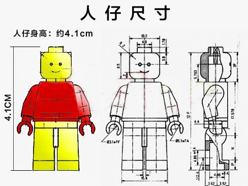
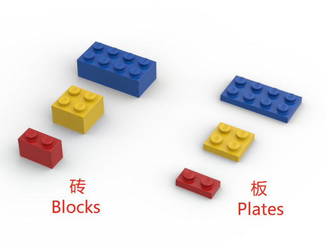
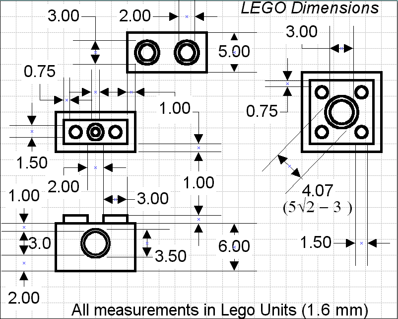

# 人仔、积木尺寸和建筑比例
建筑是空间的艺术。在建筑中，比例是至关重要的。要搭建出合理的建筑和空间，必须首先了解建筑中“人”的尺寸。
在乐高建筑的搭建中，通常以人仔的大小作为“人”的参考，一个没有任何装饰件的标准人仔尺寸如下图所示：

如果在人仔的头顶添加了头发或装饰，通常其高度在4.2cm至4.5cm之间。

以4.5cm作为人仔的通常高度，换算为175cm的真实高度，可以得到在乐高人仔世界中，2.57cm相当于真实世界中的1米：
$$
4.5cm ÷ 1.75 = 2.57cm
$$
在乐高零件的设计和制作中，通常以1.6毫米作为基础单位，称为`1 Plastic`，简称`1p`，这是标准乐高砖的塑料壁厚度。常见的乐高零件尺寸都是它的倍数，所以它是一个很好的计量单位。如果要顺利地按照人仔的尺寸构建空间，我们必须知道最常见的乐高零件尺寸。

乐高建筑的搭建中，最常见的两种零件类型为`砖（Brick）`和`板（Plate）`，他们的区别一看便知：

## 砖的尺寸

每块砖的高度为`6p（主体） + 1p（插槽）`，也就是`9.6mm + 1.6mm`。如果按照普通住宅的层高`2.8m`来换算，每层楼的高度应为7.5块砖：
$$
2.57cm × 2.8 ÷ 0.96cm = 7.5
$$

商业空间的层高首层一般是3.9、4.2、4.5米，二层及以上一般是3.6、3.9、4.2米，换算为砖的数量如下表所示：

| 真实高度（米） | 换算高度（cm） | 乐高单位（plastic） | 砖的数量 |      |
| -------------- | -------------- | ------------------- | -------- | ---- |
| 3.6            | 9.25           | 58                  | 9.67     |      |
| 3.9            | 10             | 63                  | 10.5     |      |
| 4.2            | 10.8           | 68                  | 11.33    |      |
| 4.5            | 11.57          | 72                  | 12       |      |

## 板的尺寸

每块板的高度为`2p（主体） + 1p（插槽）`，也就是`3.2mm + 1.6mm`，简单地说：3块板 = 1块砖。所以，通过砖的数量，我们可以很快地计算出板的数量。

在拼搭的过程中，我们通常会混合使用砖和板，只要我们牢记高度和数量的关系，就不会出现大的问题。

# 建筑的平面空间规划

# 建筑的立体空间规划

# 建筑的风格

# 建筑中的组件

## 门、窗

## 楼梯

## 外墙与内墙

## 常见家具

## 常见电器

## 屋顶

## 环境装饰

